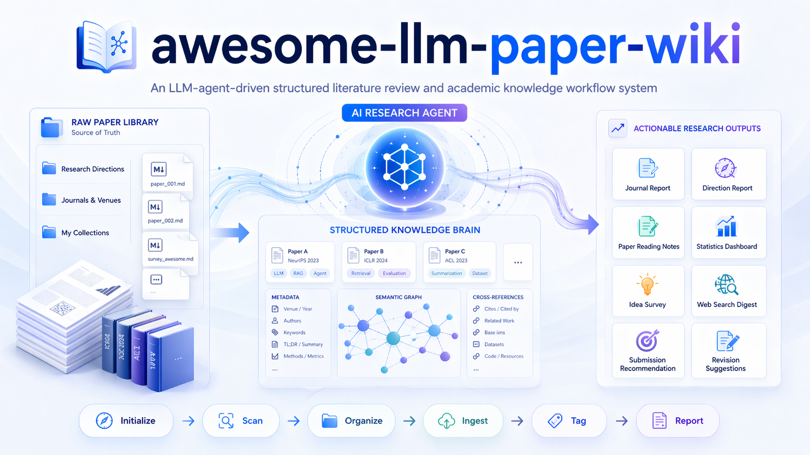

# awesome-llm-paper-wiki

[🇺🇸 English](docs/README_en.md) | [🇨🇳 简体中文](README.md)



> 一个由 LLM agent 驱动的结构化、可持续演进的文献综述系统。它可以基于本地 Markdown 文献文件，完成整理、标签、分析，并生成可用于论文写作和投稿决策的综述报告。

## 🎯 它能做什么？

awesome-llm-paper-wiki 管理一个本地 Markdown 文献库，并让你的 LLM agent 处理重复性的文献工作：

| 核心能力 | 说明 |
|------|------|
| **学术期刊整理** | 自动将论文按 `paper/{方向}/{期刊名}/` 进行分类归档整理 |
| **全维度标签管理** | 支持研究任务、底层方法、数据集、测试指标等多维复杂标签自动分析 |
| **自动化综述报告** | 基于已有文献，自动生成期刊报告、方向报告、统计报告，并撰写文献综述 |
| **单篇文献精读** | 按固定问题模板阅读单篇论文，回答问题、重要性、方法机制、核心结论和下一步工作 |
| **联网搜索接入** | 原生对接 OpenAlex / Semantic Scholar / arXiv，自动检索论文并尝试存入本地源文件（需在 config.json 配置 API key） |
| **学术投稿向导建议** | 基于项目内的本地知识网络库进行 6 维评分，并生成期刊投稿的修改建议 |

## 💡 为什么要做这个项目？

使用 Gemini、ChatGPT、Qwen、DeepSeek 等 LLM 的 deep research 功能生成报告时，常会受到文献平台访问限制，导致可引用文献数量不足、信息不完整，最终调研报告的可用性有限。

常见的文献管理平台如 Zotero，通常以 PDF 为中心组织资料。PDF 可以作为 LLM 输入，但不如 Markdown 轻量、易处理；双栏 PDF 还常常依赖多模态能力。相比之下，Markdown 文件体积小、结构清晰，更适合作为 LLM 的长期输入材料。下载论文时，直接将论文网页保存为 Markdown，下载 PDF 一样方便，却更利于后续整理、提取与复用。

因此，`awesome-llm-paper-wiki` 选择了一条更自治的路线：LLM 在原始 Markdown 文献集之上，**逐步抽离、提取、构建并维护一个专属的结构化知识层**。文献只需入库一次，随后即可被持续打标签、建立交叉引用，并随着研究推进，逐步汇编为更成熟的综述与分析报告。


## 🚀 最佳使用实践

### 1. 环境准备与安装

推荐直接运行仓库根目录下的 `install.sh` 完成安装：

```bash
bash install.sh --platform claude
bash install.sh --platform codex
```

如需手动安装，也可以将 `paper-wiki/` 复制到对应 Agent 平台的 skills 目录下。

需要在 Chrome、Edge 或 Firefox 中安装 `Obsidian Web Clipper` 插件。

### 2. 常用工作流程

大多数时候，你只需要通过自然语言告诉 Agent 下列这几个动作，即可走通一套完整的流程：

#### 第一步：准备文献源文件

由于 IEEE Trans、Elsevier 等期刊有严格的反爬机制，文献源全文文件需要手动获取。

**获取方式**：
- **期刊论文**：打开期刊论文页面，使用 `Obsidian Web Clipper` 插件保存全文。建议优先保留英文原文；也可以借助“沉浸式翻译”等插件，保存为中英混合或纯中文 Markdown。
- **会议论文**：通过 arXiv 搜索论文，点击论文右侧的 `Access Paper`，选择 `HTML (experimental)`，再使用 `Obsidian Web Clipper` 插件保存全文。
- **相关说明**：图片、公式通常可以完整保存；表格多以 HTML 形式保存，项目脚本会将其转换为更适配 Markdown 的表格格式。

**存放位置**：
- 创建研究方向目录：`paper/{Direction}/`（如 `paper/TimeSeries/`）
- 将对应的文献 Markdown 文件放入对应方向目录下即可

#### 第二步：初始化文献库

打开文献文件夹，对 Agent 发送：
```
“Initialize a paper vault” 或 “请初始化文献库”
```

#### 第三步：整理入库（建库时执行，新文献加入时重复执行）

每次有新文献加入时，执行以下三步：

```
“Scan papers”         → 扫描 `paper/` 目录，生成文件清单
“Organize by journal” → 按期刊缩写对文件归类
“Ingest papers”       → 生成 canonical 页面、提取元数据并打标签（Agent 会自动阅读并提取标签）
```

#### 第三步半：生成领域模板（可选，入库后执行）

当某个研究方向论文积累足够多（≥10 篇）时，可生成领域模板提高报告针对性：

```
“Generate domain template for {Direction}”  → 为指定方向生成领域模板
```

#### 第四步：生成综述或投稿建议（当涉及多篇文献时，建议把Agent推理能力拉到最大）

文献入库后，可执行以下分析：

```
“Read this paper: {path}”             → 单篇文献精读
“Journal report for {journal}”        → 期刊调研报告
“Direction report for {topic}”        → 方向调研报告
“Write report for {topic}”            → 撰写文献综述（普通模式约引用 40-80 篇，深度模式约引用 80-160 篇）
“Recommend submission”                → 投稿推荐（需有本地论文草稿）
“Revision suggestions for {journal}” → 针对特刊的修改建议
```

## 🛠️ 全量工作流目录

`awesome-llm-paper-wiki` 的系统技能集总共内置了 19 大工作流，**各自都可以受指令独立触发并运行。**

| 序号 | 触发工作流 | 对话触发词示例 (中/英皆可理解) | 核心板块 |
|---|--------|----------|------|
| 1 | **init** | "initialize vault" / "建库" | 数据初始化 |
| 2 | **scan-organize** | "scan papers" / "整理期刊" | 定向预处理 |
| 3 | **ingest** | "ingest papers" / "文档入库" | 定向预处理 |
| 4 | **tag** | "assign tags" / "分配打分与标签" | 定向预处理 |
| 5 | **domain-template** | "generate domain template" / "生成领域模板" | 领域模板生成 |
| 6 | **journal-report** | "XXX journal report" / "XXX 期刊报告" | 期刊调研报告 |
| 7 | **direction-report** | "TSF report" / "time series forecasting 方向报告" | 方向调研报告 |
| 8 | **stat-report** | "method stats" / "论文使用方法统计" | 论文方法等调研报告 |
| 9 | **idea-survey** | "idea survey" / "Idea 新颖性调研"| Idea锐评 |
| 10 | **web-find** | "web find" / "联网检索论文" | 网络检索 |
| 11 | **web-digest** | "daily digest" / "近期 arXiv 精选" | 网络检索推荐 |
| 12 | **web-import-clipper**| "import web clipper" / "导入剪藏文件" | 新文献处理 |
| 13 | **submission-recommend**| "recommend submission" / "投稿推荐" | 投稿推荐 |
| 14 | **revision-suggest** | "revision suggestions" / "修改建议" | 论文修改建议 |
| 15 | **status** | "vault status" / "查看知识库状态" | Agent 环境检查 |
| 16 | **lint** | "health check" / "错误/冲突与安全检查"| Agent 环境检查 |
| 17 | **pipeline** | "full pipeline" / "执行一条龙全流程" | 复合全链路执行 |
| 18 | **paper-read** | "read this paper" / "单篇文献精读" | 单篇论文理解 |
| 19 | **direction-review** | "direction review" / "方向综述" | 文献综述写作 |

> **工作流调用原则**：除非你明确要求执行 `"full pipeline"`，否则各工作流默认独立运行，不会自动串联。若前置条件缺失，Agent 会主动提示你先补齐必要步骤。

---

## 🏗️ 文献目录架构总览

```text
Your Vault/
├── paper/                     ← 原始 Markdown 文献，这是本项目的 source of truth
│   ├── Direction 1/           ← 研究的大方向 (如 Time Series)
│   │   ├── Journal 1/         ← 期刊分类下存放真实的 Markdown 源文本
│   │   └── arxiv/             ← arXiv 独立层
│   └── web_search/            ← 联网检索调研资料存放层 (不会污染正式检索树)
│
├── library/                   ← LLM Agent 为你运算生成的第二大脑【知识层】
│   ├── papers/                ← (重要) Canonical 规范化抽象标签页
│   ├── reports/               ← 自动生成的综述型报告都在该目录下
│   │   ├── paper/             ← 单篇文献精读笔记
│   │   ├── journal/           ← 期刊调研报告
│   │   ├── direction/         ← 方向调研报告
│   │   ├── idea/              ← Idea 新颖性调研等报告
│   │   ├── submission/        ← 投稿推荐与修改建议
│   │   └── web/               ← 联网检索生成的报告
│   └── indexes/               ← 自动生成的索引与统计产物
├── templates/                 ← 强定制化的 Prompt 与报告骨架输出模板
│   ├── generic/               ← 通用报告模板
│   └── domains/               ← 面向具体方向生成的领域模板
├── schema/                    ← 定义了整个系统的标签结构基石、体系映射和术语规则
├── workspace/                 ← 程序缓存、清单、日志与导入暂存目录
│   ├── cache/
│   ├── manifests/
│   ├── logs/
│   └── web-inbox/
│       └── imported/
├── scripts/                   ← 初始化到 Vault 后可直接调用的本地脚本
├── config.json                ← 文献库自定义全局配置（初始化时由示例配置生成）
└── paper-library.md           ← 全局统计数据总控看板
```

本项目秉承了结构分层的思想：
1. **正式全文库** (`paper/`)：严格人工把控进入或提取全量完整学术文本的信息基地。
2. **知识层** (`library/`)：由 Agent 基于源文本提取、压缩并构建出的结构化知识层。
3. **隔离观察层** (`paper/web_search/`)：用于存放联网检索得到的调研材料，避免污染正式文献树。

---

## 📚 进阶深度文档 (Docs)

如果你希望进一步调整底层运行机制、配置高级选项，或遇到网络调用问题，可以按需阅读以下文档：

- **[📖 自然语言指令指南 (强烈建议首先阅读)](docs/workflow_commands.md)** — 每个工作流的精确指令、执行内容、预期输出
- **[🤖 核心系统参数配置项 (config.json 说明)](docs/configuration.md)** 
- **[🚧 论文网络搜索使用 API 请求速率限制机制规避指南](docs/api_limits.md)**
- **[💻 Python 脚本组件底层实现架构逻辑](docs/architecture.md)** 

---

## 常见问题讨论 (FAQ)

### ❓ 这一套系统和传统的 Zotero / Mendeley 有什么本质区别？

Zotero 和 Mendeley 的定位是**“资料架”与文献管理器**；
由于接入了 LLM 支持，`awesome-llm-paper-wiki` 更接近一个进阶的 **“文献综述自动化助手与分析系统”**。繁杂、机械的上下文关联、概念匹配和交叉整理工作可以交给 LLM 在后台完成，因此它不仅能做文献整理与标签分类，还能持续产出有参考价值的分析报告。且文献以 Markdown 形式存储，对 LLM 阅读和信息提取都更友好。

### ❓ 强依赖某种格式约束吗？如果是普通网页随手复制的乱糟糟 Markdown 可以吗？

没有强约束。系统可以兼容大多数自由格式的 Markdown 文件。为了提高识别精度，它会优先检测文本中是否存在标准化的 YAML 元信息（Frontmatter）；如果不存在，大模型也会尝试从正文中提取标题、关键信息和基础元数据。IEEE Trans、Elsevier 以及 arXiv 导出的 Markdown 文献都已做过适配。
结论：**越标准化，识别越稳定；越随性，则越依赖模型能力，但不影响基础可用性。**

### ❓ 我可以通过本地 Obsidian 来一起可视化共生管理吗？

非常推荐。整个系统的底层就是一套纯 Markdown 文件夹结构，因此你完全可以在运行 Agent 的同时，用本地 Obsidian 打开同一个 Vault，通过双向链接、图谱视图和 Dataview 等插件观察知识网络与统计状态。

### ❓ 大部分好的Agent都需要付费，我没有Agent怎么办？

1. 把收集好的 Markdown 文献上传到 GitHub 仓库，让 LLM 基于仓库中的文献进行阅读并生成报告，报告形式可参考本项目模板。
2. 将收集好的 Markdown 文献直接导入 Google NotebookLM，然后围绕文献内容进行提问。

---

## ❤️ 致谢 (Acknowledgments)

特别鸣谢以下仓库为 AI Agent 科研自动化领域带来的宝贵指导和实现思路：
- [Andrej Karpathy's llm-wiki / Skills 理念原初探索](https://github.com/forrestchang/andrej-karpathy-skills)
- [sdyckjq-lab/llm-wiki-skill 的体系架构化借鉴](https://github.com/sdyckjq-lab/llm-wiki-skill)
- [sjqsgg/Paperwise 的学术功能洞察与自动化灵感](https://github.com/sjqsgg/Paperwise)
- [luwill/research-skills 的综述写作模板](https://github.com/luwill/research-skills)

## License

MIT
